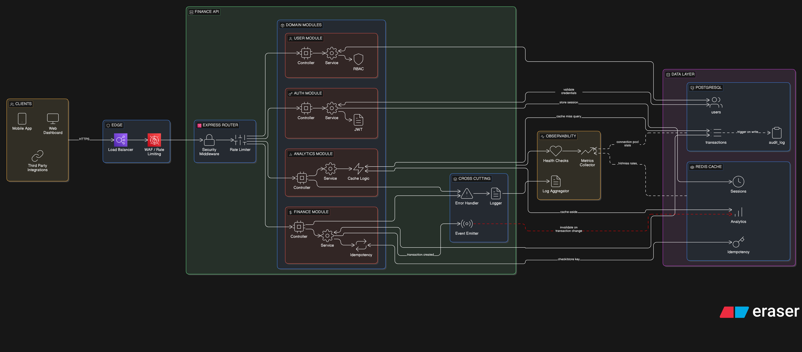
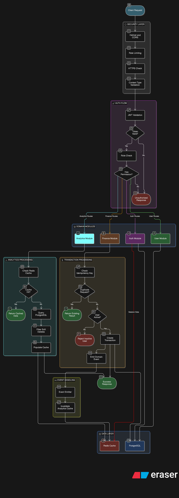
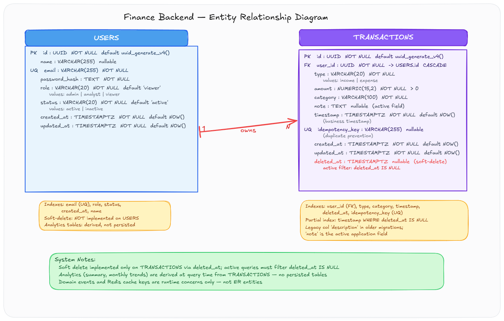

<div align="center">

# ZORVYN FINANCE BACKEND

**Modular Financial Analytics API (TypeScript + Express + PostgreSQL + Redis)**

[](https://nodejs.org/)
[](https://expressjs.com/)
[](https://www.typescriptlang.org/)
[](https://www.postgresql.org/)
[](https://redis.io/)
[](https://www.prisma.io/)
[](https://docs.docker.com/compose/)

JWT-authenticated finance API with role-based access control, idempotent transaction writes, soft deletes, DB-side analytics aggregation, and Redis cache-aside acceleration.

</div>

---

## Architecture

### System Architecture



### API Flow



### Entity Relationship Diagram



---

## Table of Contents

- [Key Features](#key-features)
- [Tech Stack](#tech-stack)
- [Project Structure](#project-structure)
- [Setup and Installation](#setup-and-installation)
- [Environment Variables](#environment-variables)
- [Swagger and OpenAPI](#swagger-and-openapi)
- [API Reference](#api-reference)
- [Data and Domain Rules](#data-and-domain-rules)
- [Caching Strategy](#caching-strategy)
- [Security and Hardening](#security-and-hardening)
- [Scripts](#scripts)
- [Notes](#notes)

---

## Key Features

| Feature                       | Implementation in This Codebase                                                                |
| ----------------------------- | ---------------------------------------------------------------------------------------------- |
| JWT Authentication            | `jsonwebtoken` access tokens (`/api/v1/auth/register`, `/api/v1/auth/login`)                   |
| RBAC Authorization            | Roles: `admin`, `analyst`, `viewer` via route middleware                                       |
| SQL-First Data Access         | `pg` pool + parameterized SQL repositories                                                     |
| Financial Precision           | `NUMERIC(15,2)` in PostgreSQL with input normalization/validation                              |
| Idempotent Transaction Create | Unique `idempotency_key` + conflict-safe insert behavior                                       |
| Soft Delete Transactions      | `deleted_at` timestamp with active-row filtering in reads/analytics                            |
| DB-Level Analytics            | `SUM` and monthly trend aggregation done in PostgreSQL                                         |
| Redis Cache-Aside             | Read endpoints cached with version-key invalidation patterns                                   |
| Event-Driven Invalidation     | `finance.transaction.changed` event invalidates analytics cache versions                       |
| Production-Focused Middleware | Helmet, CORS allowlist, HTTPS enforcement toggle, JSON content-type enforcement, rate limiting |
| Dockerized Runtime            | API + PostgreSQL + Redis with health checks in Compose                                         |

---

## Tech Stack

| Concern                   | Technology                                            |
| ------------------------- | ----------------------------------------------------- |
| Runtime                   | Node.js `>=18`                                        |
| Language                  | TypeScript `5.9.x`                                    |
| HTTP Framework            | Express `4.19.x`                                      |
| Validation                | Zod `3.x`                                             |
| Authentication            | `jsonwebtoken` + `bcryptjs`                           |
| Database                  | PostgreSQL (Docker image `15-alpine`)                 |
| SQL Access                | `pg` (`Pool`)                                         |
| Cache                     | Redis `7` (`ioredis`)                                 |
| Schema + Migration Config | Prisma config + SQL migrations in `prisma/migrations` |
| Containerization          | Docker + Docker Compose                               |

---

## Project Structure

```text
backend-assignment/
├── docs/
│   ├── architecture.png
│   ├── api-flow.png
│   └── er-diagram.png
├── prisma/
│   ├── schema.prisma
│   └── migrations/
│       ├── 001_init.sql
│       ├── 002_add_users_name.sql
│       ├── 003_phase3_transactions_schema.sql
│       ├── 004_phase6_performance_indexes.sql
│       └── 005_phase11_soft_delete.sql
├── scripts/
│   └── seed.ts
├── src/
│   ├── app.ts
│   ├── server.ts
│   ├── config/
│   │   ├── env.ts
│   │   └── jwt.ts
│   ├── db/
│   │   └── index.ts
│   ├── events/
│   │   └── domainEvents.ts
│   ├── lib/
│   │   └── Redis.ts
│   ├── middleware/
│   │   ├── auth.ts
│   │   ├── authorize.ts
│   │   ├── errorHandler.ts
│   │   └── security.ts
│   ├── modules/
│   │   ├── analytics/
│   │   ├── auth/
│   │   ├── finance/
│   │   └── user/
│   ├── types/
│   └── utils/
├── tests/
│   ├── analytics.test.ts
│   ├── auth.test.ts
│   ├── finance.test.ts
│   └── user.test.ts
├── docker-compose.yml
├── Dockerfile
├── package.json
├── prisma.config.ts
├── tsconfig.json
└── README.md
```

---

## Setup and Installation

### Prerequisites

- Node.js `>=18`
- npm `>=9`
- Docker + Docker Compose (recommended for full stack)

### 1) Install dependencies

```bash
npm install
```

### 2) Configure environment

Create your `.env` from `.env.example`.

Linux/macOS:

```bash
cp .env.example .env
```

Windows PowerShell:

```powershell
Copy-Item .env.example .env
```

### 3) Start locally

```bash
npm run dev
```

Server default: `http://localhost:3000`

### 4) Seed sample data (idempotent)

```bash
npm run seed
```

### 5) Run with Docker Compose

```bash
npm run docker:up
```

```bash
npm run docker:logs
```

```bash
npm run docker:down
```

Services:

- API: `http://localhost:3000`
- PostgreSQL: `localhost:5432`
- Redis: `localhost:6379`

Health check:

```bash
curl http://localhost:3000/health
```

---

## Environment Variables

| Variable               | Purpose                                            | Default       |
| ---------------------- | -------------------------------------------------- | ------------- |
| `NODE_ENV`             | Runtime mode (`development`, `test`, `production`) | `development` |
| `PORT`                 | API port                                           | `3000`        |
| `JWT_SECRET`           | JWT signing secret (min 16 chars)                  | required      |
| `JWT_EXPIRES_IN`       | Access token expiry                                | `1h`          |
| `DATABASE_URL`         | Full PostgreSQL URL (optional override)            | —             |
| `DB_HOST`              | PostgreSQL host                                    | `localhost`   |
| `DB_PORT`              | PostgreSQL port                                    | `5432`        |
| `DB_NAME`              | PostgreSQL database name                           | `finance_db`  |
| `DB_USER`              | PostgreSQL user                                    | `postgres`    |
| `DB_PASSWORD`          | PostgreSQL password                                | `postgres`    |
| `DB_POOL_MIN`          | PG pool minimum connections                        | `1`           |
| `DB_POOL_MAX`          | PG pool maximum connections                        | `10`          |
| `REDIS_ENABLED`        | Enable/disable cache layer                         | `true`        |
| `REDIS_HOST`           | Redis host                                         | `localhost`   |
| `REDIS_PORT`           | Redis port                                         | `6379`        |
| `REDIS_PASSWORD`       | Redis password                                     | optional      |
| `REDIS_DB`             | Redis DB index                                     | `0`           |
| `CORS_ALLOWED_ORIGINS` | Comma-separated allowlist (`*` allowed)            | `*`           |
| `API_BODY_LIMIT`       | JSON/urlencoded payload limit                      | `100kb`       |
| `TRUST_PROXY`          | Enable reverse-proxy trust                         | `false`       |
| `ENFORCE_HTTPS`        | Reject non-HTTPS requests (426)                    | `false`       |
| `RATE_LIMIT_WINDOW_MS` | Rate limit window                                  | `900000`      |
| `RATE_LIMIT_MAX`       | Global max requests per window                     | `200`         |
| `AUTH_RATE_LIMIT_MAX`  | Auth routes max requests per window                | `30`          |
| `LOGIN_RATE_LIMIT_MAX` | Login max requests per window                      | `10`          |

---

## Swagger and OpenAPI

- Swagger UI: `http://localhost:3000/docs`
- OpenAPI JSON: `http://localhost:3000/openapi.json`
- OpenAPI YAML: `http://localhost:3000/openapi.yaml`

Generate shareable spec files for Swagger Editor/Hub:

```bash
npm run openapi:export
```

Generated files:

- `docs/openapi.json`
- `docs/openapi.yaml`

---

## API Reference

Base URL: `http://localhost:3000/api/v1`

### Public

| Method | Endpoint                | Description                    |
| ------ | ----------------------- | ------------------------------ |
| `GET`  | `/health`               | Service health status          |
| `GET`  | `/api/v1`               | API info endpoint              |
| `POST` | `/api/v1/auth/register` | Register user and return token |
| `POST` | `/api/v1/auth/login`    | Login and return token         |

### Authenticated

| Method   | Endpoint                    | Roles                                                            |
| -------- | --------------------------- | ---------------------------------------------------------------- |
| `GET`    | `/api/v1/auth/me`           | `admin`, `analyst`, `viewer`                                     |
| `POST`   | `/api/v1/users`             | `admin`                                                          |
| `GET`    | `/api/v1/users`             | `admin`                                                          |
| `GET`    | `/api/v1/users/:id`         | `admin`, `analyst`, `viewer` (self-or-admin enforced in service) |
| `PUT`    | `/api/v1/users/:id`         | `admin`, `analyst`, `viewer` (self-or-admin enforced in service) |
| `DELETE` | `/api/v1/users/:id`         | `admin` (deactivates user)                                       |
| `POST`   | `/api/v1/transactions`      | `admin`, `analyst`, `viewer`                                     |
| `GET`    | `/api/v1/transactions`      | `admin`, `analyst`, `viewer`                                     |
| `PUT`    | `/api/v1/transactions/:id`  | `admin`                                                          |
| `DELETE` | `/api/v1/transactions/:id`  | `admin` (soft delete)                                            |
| `GET`    | `/api/v1/analytics/summary` | `admin`, `analyst`, `viewer`                                     |
| `GET`    | `/api/v1/analytics/trends`  | `admin`, `analyst`, `viewer`                                     |

Common response shape:

```json
{
  "success": true,
  "data": {},
  "error": null
}
```

---

## Data and Domain Rules

- **Persisted entities**: `users`, `transactions`.
- **Relationship**: one user owns many transactions (`transactions.user_id -> users.id`).
- **Transaction soft delete**: `deleted_at` is set on delete; read queries filter `deleted_at IS NULL`.
- **Idempotent transaction create**: `idempotency_key` is unique; duplicate writes return existing transaction.
- **Role and status controls**:
  - Roles: `admin`, `analyst`, `viewer`
  - User status: `active`, `inactive`
  - Inactive users are blocked from creating transactions.
- **Analytics**: summary and monthly trends are derived at query time from active transactions only.

---

## Caching Strategy

Redis is optional and fail-safe. If unavailable (or disabled), the API continues by reading from PostgreSQL directly.

| Cached Concern            | Cache Style            | TTL                   |
| ------------------------- | ---------------------- | --------------------- |
| `auth/me` payload         | key/value              | 120s                  |
| `users/:id` payload       | key/value              | 120s                  |
| `users` list pages        | versioned list keys    | 60s (version key 1h)  |
| `transactions` list pages | scope + versioned keys | 20s (version keys 1h) |
| `analytics/summary`       | versioned key          | 1h                    |
| `analytics/trends`        | versioned key          | 1h                    |

Invalidation flow:

- Transaction create/update/delete emits `finance.transaction.changed`.
- Analytics listener increments analytics version keys (all + user scope).
- User mutation increments user list version and clears user-specific cache keys.

---

## Security and Hardening

Request pipeline in `src/app.ts`:

```text
Request
	-> Helmet
	-> CORS (allowlist)
	-> Optional HTTPS enforcement
	-> Global rate limiter
	-> JSON/urlencoded parser with body limit
	-> Content-Type enforcement for write methods
	-> Route auth middleware (JWT) where required
	-> Route RBAC middleware
	-> Controller -> Service -> Repository -> PostgreSQL/Redis
	-> Global error handler
```

Notable controls:

- JWT verification with issuer/audience checks.
- Route-level RBAC and service-level ownership checks.
- Auth and login-specific rate limiting.
- Validation via Zod before business logic.
- Centralized error handling for Zod, JWT, database unique conflicts, and app errors.

---

## Scripts

| Command               | Purpose                                       |
| --------------------- | --------------------------------------------- |
| `npm run dev`         | Start API in watch mode via `tsx`             |
| `npm run start`       | Start API via `tsx src/server.ts`             |
| `npm run typecheck`   | Run TypeScript type checking (`tsc --noEmit`) |
| `npm run seed`        | Seed users and transactions (idempotent)      |
| `npm run docker:up`   | Start Docker Compose stack                    |
| `npm run docker:down` | Stop Docker Compose stack                     |
| `npm run docker:logs` | Tail Docker Compose logs                      |

---

## Notes

- SQL migration files are mounted into Postgres init scripts in Docker Compose and run on first DB initialization.
- The repository uses SQL-first runtime data access (`pg`) while keeping Prisma schema/config in the project.
- Test files exist under `tests/`; package-level test script is not currently defined.
